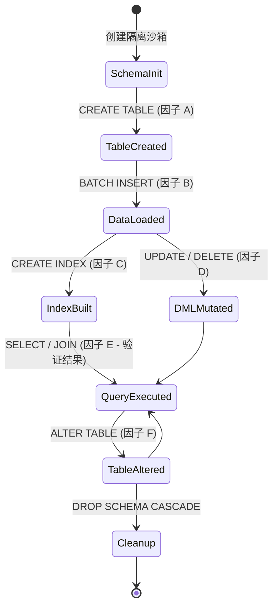
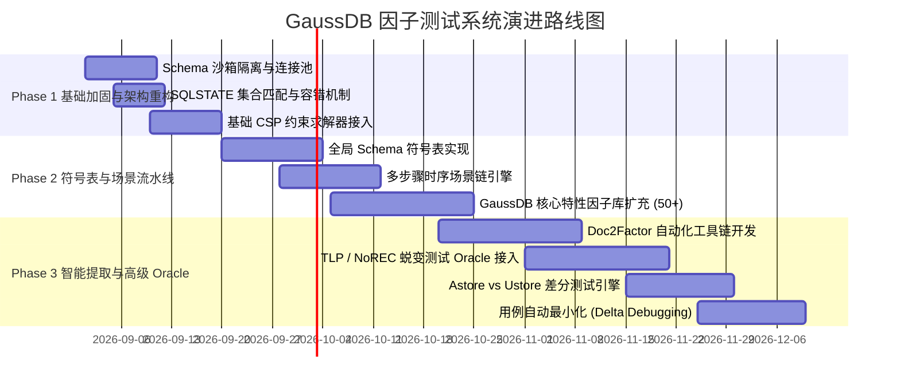

# GaussDB 测试因子系统演进规划与下一代架构方案

> 本文档针对 `gaussdb_test` 当前因子提取、组合算法、SQL 生成策略、执行机制与 Oracle 判定进行了全面评估，并规划了面向工业级落地的完整技术演进方案。

---

## 目录

- [一、 现状评估与痛点诊断](#一-现状评估与痛点诊断)
  - [1. 核心优势与合理性](#1-核心优势与合理性)
  - [2. 关键瓶颈与不合理之处](#2-关键瓶颈与不合理之处)
- [二、 下一代系统目标架构 (Next-Gen Architecture)](#二-下一代系统目标架构-next-gen-architecture)
  - [1. 全景分层架构图](#1-全景分层架构图)
  - [2. 核心数据与执行流](#2-核心数据与执行流)
- [三、 六大核心模块重构与演进设计](#三-六大核心模块重构与演进设计)
  - [1. 因子提取与建模层：Doc2Factor 与多态因子模型](#1-因子提取与建模层doc2factor-与多态因子模型)
  - [2. 组合引擎层：CSP 约束求解 + 自适应 T-way 组合](#2-组合引擎层csp-约束求解--自适应-t-way-组合)
  - [3. 生成引擎层：符号表 (Symbol Table) + 混合 AST 表达式生成](#3-生成引擎层符号表-symbol-table--混合-ast-表达式生成)
  - [4. 场景状态层：数据库状态机与管道流 (Pipeline Scenarios)](#4-场景状态层数据库状态机与管道流-pipeline-scenarios)
  - [5. Oracle 体系：三级复合断言 (错误码集 + 蜕变测试 + 差分测试)](#5-oracle-体系三级复合断言-错误码集--蜕变测试--差分测试)
  - [6. 执行与沙箱层：Schema 隔离 + 并发交错 + 用例自动最小化](#6-执行与沙箱层schema-隔离--并发交错--用例自动最小化)
- [四、 分阶段实施路线图 (Roadmap)](#四-分阶段实施路线图-roadmap)

---

## 一、 现状评估与痛点诊断

### 1. 核心优势与合理性

1. **规格驱动（Specification-Driven）的测试理念**：
   - 相比无状态的随机模糊测试（Random SQL Fuzzing），因子库基于“文档规格 $\to$ 因子 $\to$ 等价类划分 $\to$ 组合生成”，具备**高可复现性、高语义密度、可溯源（`doc_ref`）、自带 Oracle 预期**的天然优势。
2. **两两覆盖（Pairwise/IPOG）的算法合理性**：
   - 采用 IPOG 算法能够在多参数环境下以指数级降低用例规模（从 $O(V^N)$ 降至 $O(N^2 \cdot V^2)$），工业界实测可覆盖 70%~90% 的参数交互缺陷。
3. **分层清晰与轻量声明**：
   - 使用声明式 YAML 定义因子，解耦了模型、算法、生成与执行，易于理解和上手。

---

### 2. 关键瓶颈与不合理之处

| 核心维度 | 当前实现方式 | 核心缺陷与工程瓶颈 | 影响等级 |
| :--- | :--- | :--- | :--- |
| **因子提取** | 纯人工阅读手册手写 YAML | 200+ 因子编写成本巨大；内核升级（如 GaussDB 兼容模式变更）时维护滞后，易漏边界值。 | **高** |
| **SQL 生成** | 纯字符串模板替换 (`str.format`) | 无法表达 AST 递归（复杂计算表达式、嵌套子查询、多列复合主键/联合索引），单列测试脱离实际业务场景。 | **极高** |
| **因子组合** | 参数 Pairwise + 平铺 `exclusions` | 参数间复杂依赖规则缺乏自动求解器，参数增多时排除规则维护困难，组合效率受限。 | **中高** |
| **上下文拓扑** | 静态线性 `setup` | 缺乏**动态符号表（Symbol Table）**，前置因子生成的对象（表名/列名/类型）无法在后续步骤中被感知和复用。 | **高** |
| **Oracle 判定** | `expected` (单值) + `sqlstate` (单值) | 1. 多参数冲突时错误码被掩盖导致误报；<br>2. 仅能判断“是否报错/崩溃”，对 DML/DQL 无法验证查询结果与业务逻辑正确性。 | **极高** |
| **执行机制** | 事务内 `BEGIN...ROLLBACK` 串行执行 | 1. DDL 无法在事务内回滚或存在隐式提交，导致表对象残留污染测试库；<br>2. 无法测试多连接并发、锁冲突、MVCC 隔离级别。 | **中高** |

---

## 二、 下一代系统目标架构 (Next-Gen Architecture)

### 1. 全景分层架构图

```
┌────────────────────────────────────────────────────────────────────────────────────────┐
│                        GaussDB 统一智能因子测试体系 (Next-Gen)                          │
└────────────────────────────────────────────────────────────────────────────────────────┘
                                           │
  ┌────────────────────────────────────────┼────────────────────────────────────────┐
  │                                        │                                        │
  ▼                                        ▼                                        ▼
【1. 智能知识与因子库】             【2. 符号表与状态上下文】               【3. 约束驱动组合引擎】
• Doc2Factor (LLM 文档解析)         • DB Schema 动态符号表                 • CSP / SAT 约束求解器
• GaussDB 专有特性多态              • 上下文状态机 (Table/Index/Data)      • T-way 混合强度组合
• 语法与语义等价类库                • 多会话/事务生命周期管理              • 智能剪枝与去重
  │                                        │                                        │
  └────────────────────────────────────────┼────────────────────────────────────────┘
                                           │
  ┌────────────────────────────────────────┼────────────────────────────────────────┐
  │                                        │                                        │
  ▼                                        ▼                                        ▼
【4. 复合型多级 Oracle 体系】       【5. 高性能沙箱执行器】                 【6. 闭环质量与自适应演进】
• 语法与错误码集合 Oracle            • Schema 隔离沙箱 (无脏数据)           • 因子特征覆盖率度量 (Spec Coverage)
• 差分测试 (Cross-Engine/DB)        • 多会话并发交错执行器                 • 缺陷用例最小化 (Delta Debugging)
• 蜕变测试 (TLP / NoREC / PQS)      • 分布式连接池 + Crash 捕获            • Bug 驱动因子权重自适应演进
```

---

### 2. 核心数据与执行流

```mermaid
flowchart TD
    A[GaussDB 官方文档/SQL手册] -->|LLM + BNF 结构化抽取| B[增强因子库 YAML/DSL]
    B --> C[CSP 约束求解器 & T-way 组合器]
    C --> D[参数组合空间 Candidate Combos]
    D --> E[动态 Schema 符号表 & AST 混合生成器]
    E --> F[测试场景用例集 (SQL + 预期/蜕变关系)]
    F --> G[高性能 Schema 隔离执行器 (多会话并发)]
    G --> H{多级 Oracle 校验}
    H -->|Level 1| I[错误码集合 & Crash 判定]
    H -->|Level 2| J[蜕变测试 TLP / NoREC 逻辑校验]
    H -->|Level 3| K[差分测试 Astore vs Ustore]
    I & J & K --> L[测试报告 & 缺陷用例自动最小化]
```

---

## 三、 六大核心模块重构与演进设计

### 1. 因子提取与建模层：Doc2Factor 与多态因子模型

#### (1) GaussDB 专有特性多态因子定义
解耦语法骨架与 GaussDB 专有运行维度（兼容模式、存储引擎、分布策略）：

```yaml
# factors/ddl/create_table_v2.yaml
id: create_table
name: CREATE TABLE
category: DDL
doc_ref: "SQL参考/DDL/CREATE-TABLE"

# 维度 1: GaussDB 存储引擎多态
storage_engines:
  - { name: "Astore", value: "WITH (ORIENTATION = ROW)" }
  - { name: "Ustore", value: "WITH (ORIENTATION = USTORE)" }
  - { name: "Cstore", value: "WITH (ORIENTATION = COLUMN)" }

# 维度 2: 兼容模式多态
sql_compatibility:
  - PG
  - B (MySQL)
  - A (Oracle)

# 维度 3: 分布式分布键定义
distributed_options:
  - "DISTRIBUTE BY HASH({dist_col})"
  - "DISTRIBUTE BY REPLICATION"

# 参数与等价类定义 (含多值合法错误码集合)
params:
  table_modifier:
    classes:
      - { name: "普通表", values: [""], expected: success }
      - { name: "临时表", values: ["TEMPORARY", "TEMP"], expected: success }
      - { name: "非日志表", values: ["UNLOGGED"], expected: success }

  column_datatype:
    classes:
      - { name: "整数", values: ["INTEGER", "BIGINT", "SMALLINT"], expected: success }
      - { name: "高精度小数", values: ["NUMERIC(10,2)"], expected: success }
      - { name: "字符", values: ["VARCHAR(100)", "TEXT"], expected: success }
      - { name: "非法类型", values: ["FAKETYPE"], expected: error, expected_sqlstates: ["42704", "42804"] }

# 强约束规则 (供 CSP 求解器消费)
constraints:
  - "table_modifier in ['TEMPORARY', 'TEMP'] => storage_engine != 'Cstore'"
  - "storage_engine == 'Cstore' => column_constraint != 'PRIMARY KEY'"
```

#### (2) Doc2Factor 自动提取管道
* **输入**：GaussDB 产品 Markdown 手册、SQL 语法树定义。
* **处理**：利用 LLM 自动提取参数枚举表、边界值、默认值、语法约束与报错样例。
* **输出**：标准化 YAML 骨架，辅以人工专家 Review 确认。

---

### 2. 组合引擎层：CSP 约束求解 + 自适应 T-way 组合

* **引入 CSP（Constraint Satisfaction Problem）求解器**：
  将 YAML 中的 `constraints` 转化为一阶谓词逻辑，在组合空间展开前进行**前置可行域剪枝**，彻底废除低效脆弱的人工硬编码 `exclusions`。
* **混合强度 T-way 算法**：
  - 核心高危维度（如：`storage_engine` $\times$ `data_type` $\times$ `partition_type`）采用 **3-way (三两覆盖)**；
  - 边缘配置维度（如：`table_modifier` $\times$ `table_option`）采用 **2-way (Pairwise)**；
  - 极大提升深层交互 Bug 的捕获概率。

---

### 3. 生成引擎层：符号表 (Symbol Table) + 混合 AST 表达式生成

彻底突破单列、静态字符串替换的局限，建立动态 Schema 符号表与表达式生成器：

```python
# 符号表与动态上下文核心设计
class ColumnSymbol:
    name: str
    datatype: str
    is_nullable: bool
    is_primary_key: bool

class TableSymbol:
    name: str
    columns: List[ColumnSymbol]
    storage_engine: str
    partition_type: Optional[str]

class SchemaContext:
    """动态追踪并管理当前测试库中的物理与逻辑符号"""
    def __init__(self, schema_name: str):
        self.schema_name = schema_name
        self.tables: Dict[str, TableSymbol] = {}

    def register_table(self, table: TableSymbol):
        self.tables[table.name] = table

    def get_column_by_type(self, table_name: str, type_category: str) -> Optional[str]:
        """根据类型语义智能推荐列名 (用于 DML/DQL 生成)"""
        ...
```

* **微观 AST 表达式生成器**：
  在生成 `WHERE` 条件、`SELECT` 计算列、`JOIN ON` 条件时，根据符号表中已存在的列与数据类型，动态生成合法且具备复杂计算意义的表达式（如类型安全的算术运算、字符串匹配、日期加减等）。

---

### 4. 场景状态层：数据库状态机与管道流 (Pipeline Scenarios)

数据库的深层 Bug 往往出现在特定的生命周期与时序状态中。



* **Pipeline 场景链定义**：允许将多个原子因子编排为有时序依赖的状态链路。
* **数据流传递**：上游因子生成的表、视图、索引符号自动注入上下文，供下游 DML/DQL/ALTER 因子引用。

---

### 5. Oracle 体系：三级复合断言 (错误码集 + 蜕变测试 + 差分测试)

彻底解决“只能判断是否报错，不能判断数据是否正确”的核心痛点：

```
                    ┌───────────────────────────────┐
                    │      执行 SQL 测试用例        │
                    └───────────────┬───────────────┘
                                    │
            ┌───────────────────────┴───────────────────────┐
            ▼                                               ▼
     【预期报错用例】                                【预期成功用例】
  (Negative Test Cases)                           (Positive Test Cases)
            │                                               │
            ▼                                               ▼
┌───────────────────────┐                       ┌───────────────────────────────┐
│ Level 1: 错误码模糊集  │                       │ Level 2: 蜕变测试 (Metamorphic)│
│  与崩溃检测 (Crash)   │                       │  • TLP (三值逻辑分区)          │
│ • 支持多合法 SQLSTATE │                       │  • NoREC (非优化参考引擎)     │
│ • 断言连接存活状态    │                       │  • 验证优化器等价转换正确性   │
└───────────────────────┘                       └───────────────┬───────────────┘
                                                                │
                                                                ▼
                                                ┌───────────────────────────────┐
                                                │ Level 3: 跨引擎/兼容模式差分  │
                                                │ • GaussDB Astore vs Ustore    │
                                                │ • 集中式 vs 分布式结果集比对  │
                                                └───────────────────────────────┘
```

1. **Level 1（容错错误码集合 Oracle）**：
   - 允许定义候选集合 `expected_sqlstates: ["22P02", "42804"]`，只要命中其一即判定 Pass，杜绝编译阶段与执行阶段不同错误码引起的假阳性（误报）。
2. **Level 2（蜕变测试 Oracle - TLP / NoREC）**：
   - **TLP (Ternary Logic Partitioning)**：
     对任意查询 $Q$: `SELECT count(*) FROM t WHERE P;`
     生成逻辑互补查询：
     $Q_1$: `SELECT count(*) FROM t WHERE P IS TRUE;`
     $Q_2$: `SELECT count(*) FROM t WHERE P IS FALSE;`
     $Q_3$: `SELECT count(*) FROM t WHERE P IS NULL;`
     **断言验证**：$\text{count}(Q) == \text{count}(Q_1) + \text{count}(Q_2) + \text{count}(Q_3)$。全自动校验 GaussDB 查询优化器的计算正确性。
   - **NoREC (Non-optimizing Reference Engine Construction)**：
     通过优化器开关（Hint）关闭特定优化路径，比对优化前后执行结果的一致性。
3. **Level 3（跨存储引擎/版本差分测试 Oracle）**：
   - 同一 Schema 和数据集在 **Astore** 与 **Ustore** 上同时运行相同查询，校验结果集一致性，精准捕获 Ustore 回滚段与 Undo 引擎深层缺陷。

---

### 6. 执行与沙箱层：Schema 隔离 + 并发交错 + 用例自动最小化

* **Schema 级沙箱隔离机制**：
  为每个测试批次分配独立 Schema（如 `factortest_run_20260826_001`），执行前 `SET search_path`，执行完毕后 `DROP SCHEMA ... CASCADE`。从根本上解决 DDL 隐式提交导致的表残留与库污染问题。
* **多会话并发执行器（Concurrency Executor）**：
  支持开辟 2~4 个独立 Client Connection，按时间线交错提交 DDL、DML 和事务控制语句，测试锁升级、死锁检测机制与 MVCC 隔离一致性。
* **用例自动最小化（Delta Debugging）**：
  当捕获到 Core Dump 或结果集不一致时，自动进入二分回退剪枝循环，去除无关列、冗余 WHERE 条件与多余表，输出只有 2~3 行的最小可复现用例（MRE），直接赋能内核研发定位。

---

## 四、 分阶段实施路线图 (Roadmap)



### 关键里程碑目标

| 阶段 | 周期 | 核心交付物 | 预期收益 |
| :--- | :--- | :--- | :--- |
| **Phase 1: 基础加固** | 2 周 | Schema 沙箱执行器、SQLSTATE 集合支持、CSP 约束引擎 | 彻底解决测试库污染问题，误报率降低 90% 以上。 |
| **Phase 2: 符号与场景** | 4 周 | 动态符号表、多步骤场景链、50+ GaussDB 专有因子（Ustore/分区/分布键） | 能够执行多列复杂业务链路，真实覆盖内核跨阶段状态。 |
| **Phase 3: 智能与高级 Oracle** | 8 周 | Doc2Factor 工具链、TLP/NoREC 蜕变测试、差分比对、MRE 最小化 | 实现文档到用例半自动流转，具备检测 GaussDB 优化器与执行器正确性缺陷的工业级能力。 |
